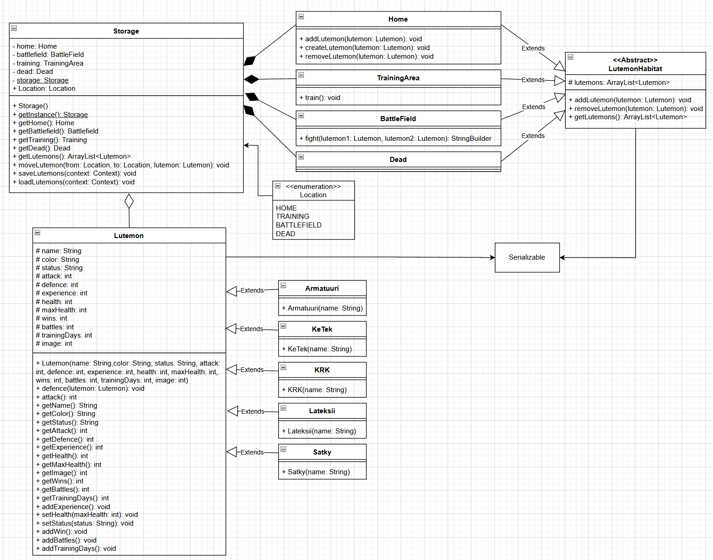
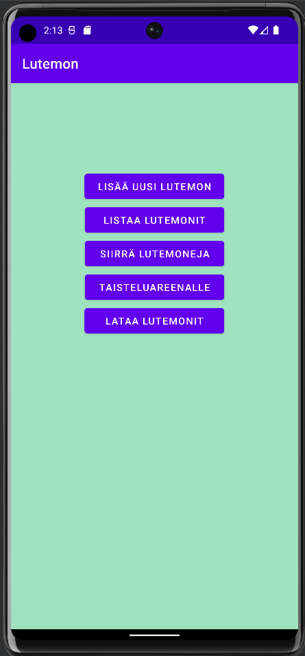
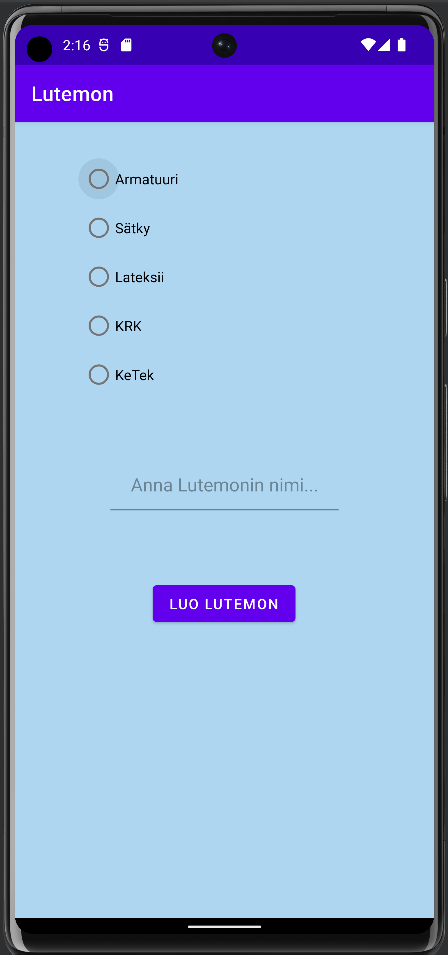
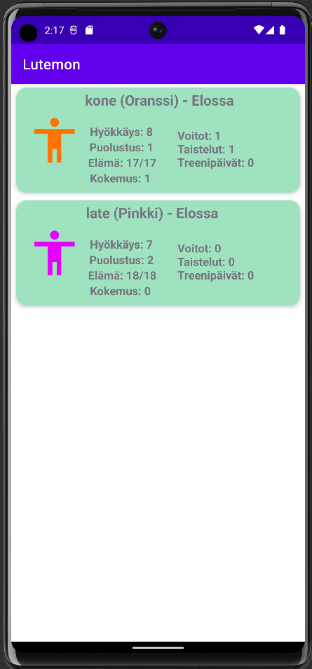
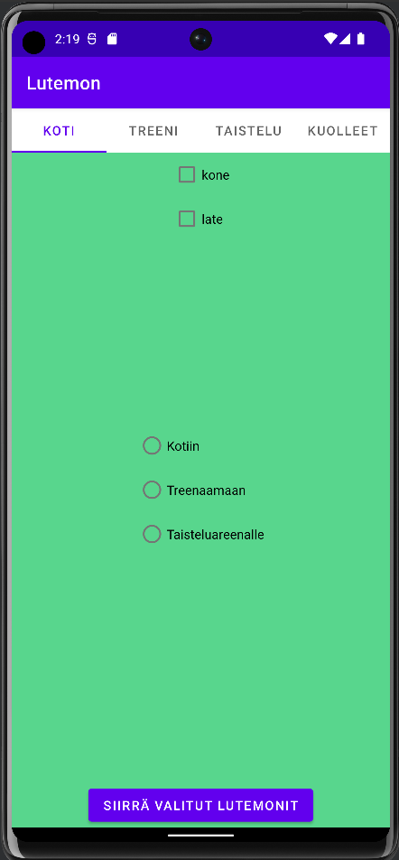
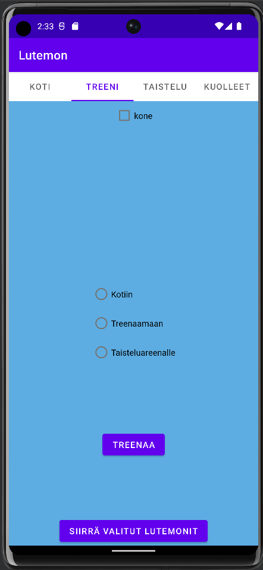
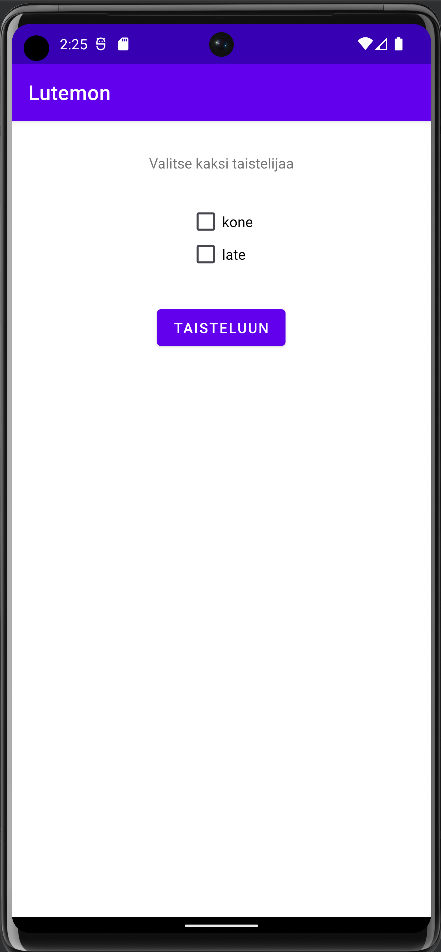
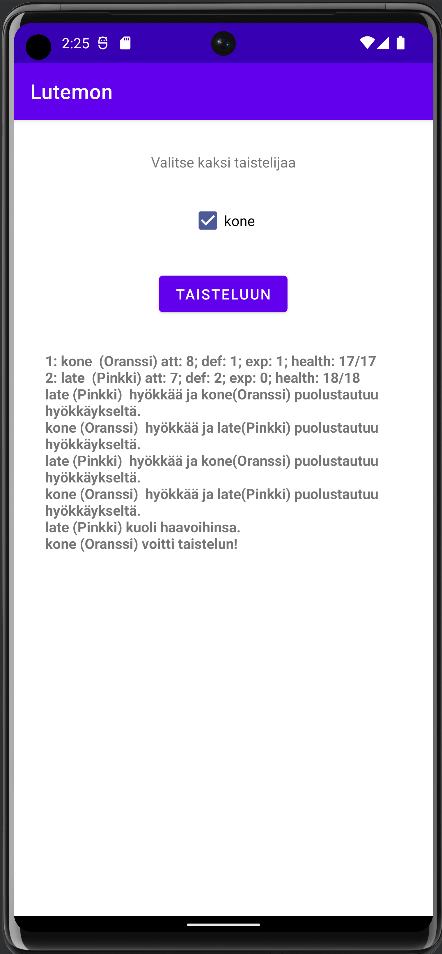

# Lutemon
**Tekijät:** Daniel Tuukkanen, Sami Anttalainen ja Hannes Turppo ©

**Demovideo:** https://youtu.be/opoSL6qWmD0

## Vaatimukset
**Oliokoodi:** Ohjelma noudattaa kurssilla opetettuja olio-ohjelmoinnin periaatteita ja kurssin keskustelupalstalla hyväksyttyjä tietorakenteita.

**Koodi on englanniksi:** Kyllä

**Ohjelma toimii androidilla:** Kyllä

**Ohjelma sisältää perustoiminnallisuuden:** Kyllä, ohjelma sisältää kaikki harjoitustyöohjeessa vaaditut toiminnallisuudet.

**RecyclerView:** Kyllä, lutemoneja listatessa käytetään RecyclerView-komponenttia.

**Lutemoneilla on kuva:** Kyllä, eriväriset lutemonit esitetään erilaisella kuvalla.

**Taistelu on visualisoitu:** Ei

**Tilastot:** Kyllä, kaikkia lutemoneja listatessa jokaisen lutemonin kohdalla näkyy käytyjen taistelujen, voittojen ja treenipäivien määrä.

**Kuolema pois:** Ei, mielestämme tämä olisi tuhonnut koko kuoleman olemassa olon täysin. (Miksei vakiona kuolema pois ja lisäpisteenä se, että kuoleman mahdollisuus on olemassa)

**Satunnaisuus:** Kyllä, lutemonien hyökkäysvoima vaihtelee.

**Fragmentit:** Kyllä, ohjelman MoveActivity käyttää TabLayout:issa neljää fragmenttia eri sijainteihin tallennettujen lutemonien näyttämiseen.

**Tietojen tallennus ja lataus:** Kyllä, kun lutemoneihin tai niiden sijaintiin tehdään muutoksia, lutemonit tallennetaan ja käyttäjä voi halutessaan palauttaa aiemmat lutemonit laitteen muistista.

**Tilastojen visualisointi:** Ei

**Ominaisuus X:** Toastit, Käyttäjän suorittaessa toimintoja ja poikkeustilanteissa, käyttäjää informoidaan tapahtumista toastilla. Pyydetään 2 pistettä.

## Ohjelman luokkakaavio

## Ryhmän työnjako
Kaikki ryhmän jäsenet osallistuivat kaikkiin ohjelman rakentamisen vaiheisiin. Daniel ja Sami tekivät suurimman osan ohjelman rakennustyöstä ja toiminnallisuudesta. Hannes teki toiminnallisuuksia lutemonien siirtämiseen, poikkeustenkäsittelyä, koodin kommentointia ja dokumentaation. Lisäksi Daniel formatoi dokumentaation .md-yhteensopivaksi.

## Toiminnallisuuden esittely

### Päävalikko:
Päävalikossa käyttäjä voi siirtyä ohjelman eri osioihin tai ladata aiemmin tallennetut lutemonit uudestaan käyttöön.

### Uuden lutemonin luominen:
Uuden lutemonin luomisnäkymässä käyttäjä valitsee luotavan lutemonin tyypin ja nimeää sen.

### Lutemonien listaus:
Lutemonien listauksessa ohjelma näyttää RecyclerView:issä kaikki ohjelman eri osioihin tallennetut lutemonit.

### Lutemonien siirtäminen:
Lutemonien siirtämisosiossa lutemoneja siirretään eri osioiden väillä. Kuolleita lutemoneja ei voi siirtää enää mihinkään, eikä niitä enää tallenneta kuten muita lutemoneja. Takaisin kotiin siirretyt lutemonit saavat täydet elämäpisteensä takaisin.

### Treenaus:
Lutemonien treenaus tapahtuu siirtämisaktiviteetin “Treeni”-osiossa. Osiossa oleva nappi treenaa kaikkia osioon sijoitettuja lutemoneja. Treenaaminen lisää käytännössä lutemonin hyökkäysvoimaa yhdellä.

### Taistelu:
Taistelussa käyttäjä valitsee kaksi lutemonia, joiden taistelu tulostetaan TextView näkymään. Taistelun voittanut lutemon saa yhden kokemuspisteen.

