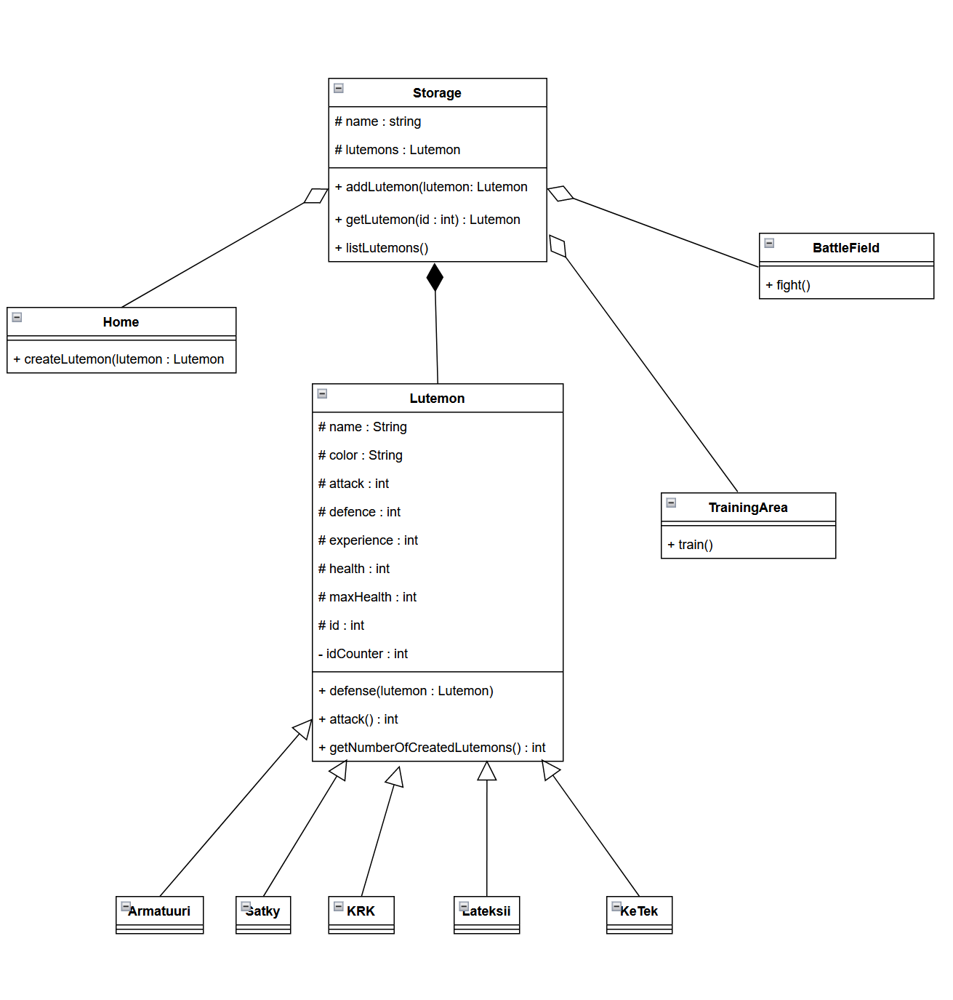

# Lutemon
Olio-ohjelmointi harjoitustyö

## Harjoitustyösuunnitelma
Tavoitteena on toteuttaa kolmen hengen ryhmässä Pokemon pelien tyylinen Android-sovelluspeli Javalla, jossa erilaisia olioita voidaan treenata ja laittaa taistelemaan toisiaan vastaan. Ohjelman päänäkymässä voidaan siirtyä eri näkymiin (fragmentteihin), joissa voidaan kouluttaa olioita, lisätä olioita, listata oliot tai taistella. Käytännössä tehtävänannon mukainen peli. Ohjelmasta löytyy myös viisi erilaista Lutemon-tyyppiä.

## Alustava luokkakaavio:

## Käyttöliittymä
### Päänäkymä
Käyttöliittymässä on päänäkymä, josta voidaan siirtyä eri näkymiin (fragmentteja)  painamalla. 
### Listausnäkymä
Listausnäkymässä voidaan tarkastella Lutemonien tietoja. Listauksessa näkyy Lutemonin nimi, tiedot sekä kuva. 
### Lisäysnäkymä
Lisäysnäkymässä voidaan luoda uusia Lutemoneja antamalla Lutemonille nimi ja valitaan RadioButton-valikosta haluttu laji. Painamalla luo nappia Lutemon lisätään listaan. Listaus toteutetaan Recycler Viewillä. 
### Harjoitusnäkymä
Harjoitusnäkymässä voidaan valita tietyt Lutemonit, joita halutaan treenata. 
### Taistelunäkymä
Taistelunäkymässä voidaan taas valita Lutemoneja taistelemaan keskenään. Näkymässä on myös taistelun taisteluloki, josta nähdään taistelun kulku.
